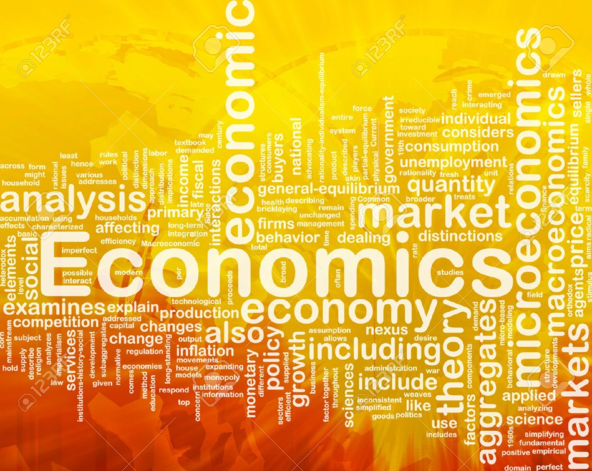

<style>
  @font-face {
    font-family:'BYekan';/*تعریف یک نام برای فونت*/
    src:url('BYekan.eot');/*اکسپلورر 9 به بعد*/
    src:local('bYekan'),/*بررسی نصب بودن فونت در سیستم کاربر*/
        local('b Yekan'),/*برای برخی از مرورگرها مانند سافاری*/
        url('BYekan.eot?#iefix') format('embedded-opentype'),/*هک برای اکسپلورر 8 و ماقبل*/
        url('BYekan.woff') format('woff'),/*مرورگر های جدید*/
        url('BYekan.ttf') format('truetype'),/*تمام مرورگرها به جزء اکسپلورر*/
        url('BYekan.svg#BYekan') format('svg');/*نسخه های قدیمی سیستم عامل iOS*/
    font-style:normal;
    font-weight:normal;
  }
  body {
    font-family:BYekan;
  }
  @media (min-width: 768px) {
    .navbar-header {
      float: right !important;
      direction: rtl !important;
    }
    .navbar-nav>li {
      float: right !important;
      direction: rtl !important;
    }
    .navbar-left {
      float: right !important;
    }
  }
  .chart-title {
    direction: rtl !important;
    font-size: 18px;
  }
  .fa {
    margin-right: 0px !important;
    margin-left: 7px !important;
  }
  .desktop-layout {
    direction: rtl;
  }
  p {
    font-size: 14px;
  }
</style>

```{r setup, include=FALSE}
library(flexdashboard)
```

صفحه اصلی {data-icon="fa-inbox"}
=====================================
Column {data-width=35%}
-----------------------------------------------------------------------
### **درباره پروژه**

سلام این یک تست می باشد

### فهرست مطالب

Column {data-width=65%}
-----------------------------------------------------------------------

###



رشد اقتصادی (Economic growth) {data-icon="fa-line-chart"}
===

تولید ناخالص (Gross production) {data-icon="fa-money"}
===